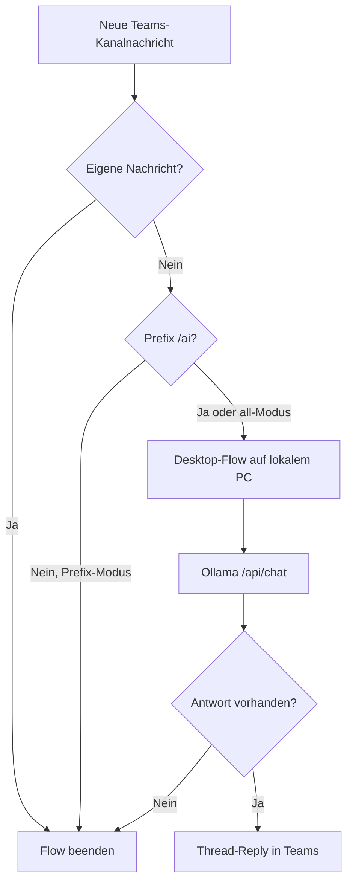

# Teams-KI-Assistent mit Power Automate (ohne eigene Entra-App)

Diese Anleitung beschreibt, wie Sie einen Microsoft-Teams-Kanal-Assistenten **ohne eigene App-Registrierung in Entra** betreiben können. Statt Microsoft Graph direkt aus Python zu pollen, übernimmt **Power Automate** den Teams-Zugriff über eingebaute Microsoft-Connectors mit **Ihrem persönlichen M365-Login**.

---

## 1. Architekturübersicht

### Variante A (empfohlen): Hybrid mit lokalem Ollama

```
Neue Teams-Kanalnachricht
        │
        ▼
Power Automate (Cloud-Flow)
  - Trigger: "Bei neuer Kanalnachricht"
  - Filter (Prefix / eigene Nachrichten ignorieren)
        │
        ▼
Power Automate Desktop (lokal auf Windows-PC)
  - HTTP POST an http://127.0.0.1:11434/api/chat
        │
        ▼
Ollama (lokal)
        │
        ▼
Antwort zurück an Cloud-Flow
        │
        ▼
"Antwort auf Kanalnachricht" in Teams
```

**Vorteile**

- Keine eigene Entra-App nötig
- Ollama bleibt lokal (Datenschutz)
- Teams-Lesen und -Schreiben über Standard-Connectors

**Nachteile**

- Der Windows-PC mit Ollama und Power Automate Desktop muss laufen
- Zusätzliche Power-Automate-Lizenzierung möglich
- Weniger flexibel als die Python-Lösung

### Variante B: Vollständig in der Cloud (ohne Ollama)

```
Teams-Nachricht → Power Automate → Azure OpenAI / AI Builder → Teams-Antwort
```

Einfacher im Betrieb, aber **kein lokales Ollama** und ggf. Kosten für Azure OpenAI.

Diese Anleitung fokussiert auf **Variante A**.

---

## 2. Voraussetzungen

### Konten und Lizenzen

| Komponente | Anforderung |
|---|---|
| Microsoft 365 / Teams | Zugriff auf den Ziel-Kanal |
| Power Automate | In vielen M365-Lizenzen enthalten; prüfen Sie Ihr Admin Center |
| Premium-Connectors | Für **HTTP** und **Desktop-Flow ausführen** oft Premium-Lizenz oder Pay-per-flow nötig |
| Power Automate Desktop | Kostenlos installierbar; Ausführung aus Cloud-Flow erfordert registrierte Maschine |
| Ollama | Lokal installiert (wie in der Haupt-README) |
| Windows 11 PC | Soll während der Nutzung eingeschaltet sein |

### Software auf dem lokalen PC

```powershell
# Ollama installiert und Modell vorhanden
ollama pull qwen3:14b
.\scripts\check_ollama.ps1   # aus dem Python-Projekt, optional
```

Power Automate Desktop: https://powerautomate.microsoft.com/desktop/

---

## 3. Vorbereitung in Teams

1. Verwenden Sie einen **dedizierten Kanal** für Tests (nicht `#General` mit hohem Verkehr).
2. Notieren Sie **Team-Name** und **Kanal-Name** (werden im Flow-Trigger ausgewählt).
3. Entscheiden Sie den Trigger-Modus:

| Modus | Umsetzung in Power Automate |
|---|---|
| `all` | Jede Nachricht verarbeiten (nur in Testkanälen) |
| `prefix` | Bedingung: Nachricht beginnt mit `/ai` |
| `mention` | Bedingung: Erwähnung Ihres Namens in der Nachricht |

4. **Schleifenschutz:** Der Flow darf nicht auf **eigene Antworten** reagieren. Dafür bauen Sie eine Bedingung ein (siehe Abschnitt 7).

---

## 4. Power Automate Desktop-Flow (lokales Ollama)

Erstellen Sie zuerst den Desktop-Flow, damit die Cloud-Lösung ihn später aufrufen kann.

### 4.1 Neuen Desktop-Flow anlegen

1. Öffnen Sie **Power Automate Desktop**.
2. **Neuer Flow** → Name: `Ollama Teams Antwort`
3. Trigger: **Manueller Auslöser** mit Eingabeparameter:

| Parameter | Typ | Beispiel |
|---|---|---|
| `UserMessage` | Text | Die bereinigte Teams-Nachricht |
| `SystemPrompt` | Text | `Du bist ein hilfreicher interner Assistent...` |

### 4.2 HTTP-Anfrage an Ollama

Aktion: **Webdienste aufrufen** (oder "Invoke web service")

| Feld | Wert |
|---|---|
| Methode | `POST` |
| URL | `http://127.0.0.1:11434/api/chat` |
| Content-Type | `application/json` |
| Body | siehe JSON unten |

**JSON-Body (als Text, Variablen einsetzen):**

```json
{
  "model": "qwen3:14b",
  "messages": [
    {
      "role": "system",
      "content": "%SystemPrompt%"
    },
    {
      "role": "user",
      "content": "%UserMessage%"
    }
  ],
  "stream": false,
  "keep_alive": "10m"
}
```

> In PAD `%SystemPrompt%` und `%UserMessage%` durch die Flow-Variablen ersetzen (über die UI "Variable einfügen").

### 4.3 JSON-Antwort auswerten

1. Aktion: **JSON aus Webdienst parsen** auf die HTTP-Antwort.
2. Pfad zur Antwort: `message.content` (je nach PAD-Version: manuell im JSON-Pfad setzen).
3. Aktion: **Flow beenden** → Rückgabewert: der extrahierte Text.

### 4.4 Desktop-Flow testen

1. **Ausführen** mit Testeingabe:
   - UserMessage: `Was ist 2+2?`
   - SystemPrompt: `Antworte kurz auf Deutsch.`
2. Erwartung: Rückgabe `4` oder ähnlich.

### 4.5 Maschine für Cloud-Aufruf registrieren

1. In Power Automate Desktop: Einstellungen → mit Cloud-Konto verbinden.
2. Unter https://make.powerautomate.com → **Einstellungen** → **Maschinen** prüfen, ob Ihr PC als **Hosted Machine** / **Standard machine** sichtbar ist.

Ohne registrierte Maschine kann der Cloud-Flow den Desktop-Flow nicht starten.

---

## 5. Cloud-Flow erstellen (Teams-Trigger)

### 5.1 Flow anlegen

1. Öffnen Sie https://make.powerautomate.com
2. **Erstellen** → **Automatisierter Cloud-Flow**
3. Name: `Teams Kanal → Ollama Assistent`
4. Trigger suchen: **Wenn eine neue Kanalnachricht hinzugefügt wird**  
   (engl.: *When a new channel message is added*, Connector: **Microsoft Teams**)
5. Verbindung mit Ihrem M365-Konto herstellen (einmalig).

### 5.2 Trigger konfigurieren

| Feld | Wert |
|---|---|
| Team | Ihr Ziel-Team |
| Kanal | Ihr Ziel-Kanal |

Der Trigger liefert u. a.:

- Nachrichtentext (`body` / `body.content`)
- Absender (`from.user.displayName`, ggf. E-Mail)
- Nachrichten-ID (`id`)
- Erwähnungen (`mentions`)

---

## 6. Cloud-Flow Logik (Schritt für Schritt)

### Schritt 1: Eigene Nachrichten ignorieren

**Bedingung** hinzufügen:

```
Absender-E-Mail (oder Anzeigename) ist nicht gleich [Ihre E-Mail]
```

Oder:

```
triggerOutputs()?['body/from/user/displayName']  nicht gleich  'Max Mustermann'
```

**Wenn nein** (eigene Nachricht): Flow beenden.

### Schritt 2: Prefix-Filter (optional)

Wenn Sie nur `/ai` verarbeiten wollen:

**Bedingung:**

```
triggerOutputs()?['body/body/content']  beginnt mit  '/ai'
```

**Wenn ja:** Variable `CleanMessage` setzen:

```
replace(triggerOutputs()?['body/body/content'], '/ai', '')
```

Sonst bei `all`: `CleanMessage` = roher Nachrichtentext (HTML ggf. bereinigen, siehe unten).

### Schritt 3: HTML bereinigen (empfohlen)

Teams liefert oft HTML. Einfachste Variante in Power Automate:

- Aktion **Compose** mit `strip()` / `replace` für `<p>`, `<at>`, etc.
- Oder nur Plaintext akzeptieren, wenn Ihre Nutzer ohne Formatierung schreiben.

Für robuste Bereinigung können Sie weiterhin das Python-Projekt lokal als Hilfsdienst nutzen – für den Einstieg reicht oft Plaintext.

### Schritt 4: Desktop-Flow ausführen

Aktion: **Einen mit Power Automate Desktop erstellten Flow ausführen**  
(engl.: *Run a flow built with Power Automate Desktop*)

| Feld | Wert |
|---|---|
| Maschine | Ihr registrierter Windows-PC |
| Desktop-Flow | `Ollama Teams Antwort` |
| UserMessage | `CleanMessage` |
| SystemPrompt | `Du bist ein hilfreicher interner Assistent in Microsoft Teams. Antworte präzise, sachlich und auf Deutsch.` |

Ausgabe in Variable `OllamaResponse` speichern.

### Schritt 5: Leere Antwort prüfen

**Bedingung:** `OllamaResponse` ist nicht leer.

Wenn leer → Flow beenden (keine Teams-Antwort senden).

### Schritt 6: Antwort als Thread-Reply posten

Aktion: **Mit einer Nachricht in einem Kanal antworten**  
(engl.: *Reply with a message in a channel*, Connector: **Microsoft Teams**)

| Feld | Wert |
|---|---|
| Team | wie im Trigger |
| Kanal | wie im Trigger |
| Nachrichten-ID | `id` aus dem Trigger (Parent Message) |
| Nachricht | `OllamaResponse` (ggf. in `<p>...</p>` für HTML) |

Damit erscheint die Antwort **unter der ursprünglichen Nachricht** im Thread.

### Schritt 7: Flow speichern und aktivieren

1. **Speichern**
2. Flow ist standardmäßig **ein** (aktiv)
3. Testnachricht im Kanal senden

---

## 7. Schleifenschutz (wichtig)

Ohne Schutz antwortet der Bot auf **eigene Antworten** in Endlosschleifen.

Mindestens diese Schutzstufen einbauen:

1. **Absenderfilter** (Abschnitt 6, Schritt 1)
2. **Prefix-Modus** `/ai` nur für manuelle Anfragen
3. Optional: Bedingung `messageType` gleich `message` (keine Systemereignisse)

Zusätzlich in einem Testkanal arbeiten und nicht in `#General`.

---

## 8. Kompletter Ablauf als Diagramm



---

## 9. Fehlerbehebung

### Desktop-Flow wird nicht gestartet

| Ursache | Lösung |
|---|---|
| PC aus / schläft | PC eingeschaltet lassen, Energiesparen anpassen |
| PAD nicht verbunden | In PAD erneut mit Cloud-Konto anmelden |
| Maschine nicht registriert | Unter make.powerautomate.com → Maschinen prüfen |
| Premium-Lizenz fehlt | Admin nach Power Automate Premium / Process-Lizenz fragen |

### Ollama-Fehler / Timeout

```powershell
curl http://127.0.0.1:11434/api/tags
ollama serve
```

Modellname in PAD exakt wie `ollama list` (z. B. `qwen3:14b`).

### Teams-Antwort erscheint nicht

- Prüfen Sie, ob der Flow in **Ausführungsverlauf** grün oder rot ist
- Connector-Berechtigung für Teams erneut autorisieren
- Prüfen Sie, ob **Nachrichten-ID** korrekt an die Reply-Aktion übergeben wird

### Flow antwortet auf alte Nachrichten

Der Trigger feuert nur für **neue** Nachrichten nach Aktivierung – vergleichbar mit `PROCESS_BACKLOG=false` in der Python-App.

### 403 / Zugriff verweigert

- Sie brauchen Zugriff auf Team und Kanal
- Manche Organisationen schränken Power-Automate-Teams-Connectors ein → IT fragen

---

## 10. Lizenzierung (Kurzüberblick)

Die genaue Lizenz hängt von Ihrem Tenant ab. Typisch:

| Feature | Häufige Lizenz |
|---|---|
| Teams-Trigger | Office 365 / M365 |
| Desktop-Flow aus Cloud | Power Automate Premium oder Process |
| HTTP in Desktop | in Desktop enthalten |

Fragen Sie IT:

> „Ist Power Automate Premium oder eine Process-Lizenz für Desktop-Flows aus der Cloud verfügbar?“

---

## 11. Vergleich: Power Automate vs. Python-Graph-Lösung

| Kriterium | Power Automate | Python + Graph (dieses Repo) |
|---|---|---|
| Eigene Entra-App | Nicht nötig | Erforderlich |
| Lokales Ollama | Ja (mit Desktop) | Ja |
| PC muss laufen | Ja | Ja |
| Thread-Replies | Ja (Reply-Aktion) | Ja (Graph API) |
| Erweiterbarkeit | Begrenzt | Hoch (RAG, SQLite, CLI) |
| Transparenz / Tests | Geringer | Unit-Tests, Logs, Code |
| Kosten | ggf. Premium-Lizenz | Keine Zusatzlizenz |

---

## 12. Erweiterungen

### Gesprächskontext (mehrere Nachrichten)

In Power Automate schwieriger als in SQLite. Möglichkeiten:

- **SharePoint-Liste** oder **Dataverse** als Konversationsspeicher
- Pro `root_message_id` Einträge mit Rolle `user` / `assistant`
- Vor Ollama-Aufruf letzte N Einträge als Kontext laden

### Statt Desktop-Flow: HTTP über Tunnel

Wenn IT einen sicheren Reverse-Proxy erlaubt:

```
Cloud Flow → HTTPS → lokaler FastAPI-Endpunkt → Ollama
```

Dann könnten Sie Teile des Python-Projekts (`app/llm_client.py`) weiterverwenden. Für den PoC war bewusst kein Tunnel vorgesehen.

### Azure OpenAI statt Ollama

Ersetzen Sie den Desktop-Flow-Schritt durch die **Azure OpenAI**-Aktion in Power Automate – komplett cloudbasiert, ohne lokalen PC.

---

## 13. Checkliste zum Start

- [ ] Dedizierten Teams-Testkanal gewählt
- [ ] Ollama läuft lokal, Modell gepullt
- [ ] Power Automate Desktop installiert und angemeldet
- [ ] Desktop-Flow `Ollama Teams Antwort` getestet
- [ ] Cloud-Flow mit Teams-Trigger erstellt
- [ ] Eigene Nachrichten werden gefiltert
- [ ] Prefix `/ai` eingebaut (empfohlen)
- [ ] Thread-Reply-Aktion konfiguriert
- [ ] Testnachricht gesendet und Antwort geprüft

---

## 14. Support bei IT

Wenn etwas blockiert ist, diese konkrete Anfrage stellen:

> „Ich möchte einen Power-Automate-Flow nutzen, der bei neuen Nachrichten in einem Teams-Kanal einen lokalen Desktop-Flow auf meinem Arbeits-PC ausführt und die Antwort als Thread-Kommentar zurückschreibt. Bitte prüfen Sie, ob Microsoft Teams Connectors in Power Automate und Power Automate Desktop (Cloud-gekoppelt) für mein Konto freigeschaltet sind.“

Das ist deutlich einfacher für IT als eine eigene Entra-App mit Graph-Berechtigungen.
